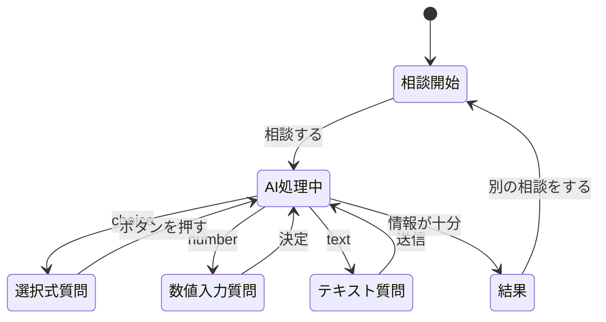

# Webアプリ仕様書

## 1. 概要

ユーザーが「何について迷っているか」を入力すると、LLMがその意思決定に必要な条件を判断し、不足している情報を質問するWebアプリ。

ユーザーはAIからの質問に回答し、十分な情報が集まった段階で、AIが選択肢を比較して、おすすめの選択肢とその理由を表示する。

AIからの質問への回答は、ユーザーの入力負担を減らすため、**可能な限り選択肢をボタンで表示する**。

金額・距離・時間など、選択肢だけでは回答しにくい場合のみ数値入力やテキスト入力を使用する。

単にAIが結論を出すのではなく、**ユーザー自身でも気づいていない判断条件をAIとのやり取りによって整理すること**を目的とする。

### アプリ名

**AI意思決定サポーター**

---

# 2. 想定する利用者

本アプリは、**複数の選択肢の中から何かを決めたいが、どのような条件を基準に判断すればよいか分からず困っている人**を対象とする。

例えば、以下のような状況を想定する。

- 複数の商品からどれを購入するか迷っている
- アルバイトや進路など、複数の候補から選びたい
- 旅行先や移動手段などを決めたい
- 選択肢ごとのメリット・デメリットを整理できていない
- 自分が何を重視して選ぶべきか分からない
- 判断に必要な条件自体が分からない

### 具体的な利用例

ユーザーが、

> 大学用のPCをノートPCにするかデスクトップPCにするか迷っている

と入力する。

しかし、ユーザー自身は、

- 持ち運ぶ頻度
- 使用目的
- 必要な性能
- 予算

など、**どの条件を考えて決める必要があるのか十分に整理できていない**。

そこでAI意思決定サポーターが、意思決定に必要な条件を判断し、例えば

> 大学へPCを持ち運ぶ頻度はどのくらいですか？

と質問し、画面には次のボタンを表示する。

```text
[ ほぼ毎日 ]
[ 週に数回 ]
[ 月に数回 ]
[ ほとんどない ]
```

ユーザーは文章を入力せず、該当するボタンを押して回答していき、AIとのやり取りを通して判断条件を整理する。

---

# 3. 今と、これから（As-Is / To-Be）

## 3.1 As-Is

現在、何かを選ぶ場合は、

- 判断条件を自分で考える
- 必要な情報を調べる
- 複数の条件を比較する
- 最終的に自分で整理して決める

必要がある。

また、一般的なAIチャットを利用する場合でも、

- AIからの質問に毎回文章で回答する必要がある
- 「はい」「いいえ」だけでも文字入力が必要
- スマートフォンなどでは入力が面倒
- 質問が続くと利用者の負担が大きい

という問題がある。

---

## 3.2 Gap

不足しているのは、

**利用者の状況に応じてAIが質問を生成し、その質問に簡単な操作で回答できる仕組み**

である。

---

## 3.3 To-Be

AI意思決定サポーターでは、

- 最初に迷っている内容だけ入力する
- AIが必要な条件を判断する
- AIが質問を生成する
- AIが回答候補も生成する
- 基本的にはボタンを押すだけで回答できる
- 数値が必要な場合のみ数値を入力する
- 必要な情報が揃ったらAIが結果を生成する

状態を目指す。

```text
相談内容を入力
      ↓
AIが必要な条件を判断
      ↓
AIが質問＋回答候補を生成
      ↓
ユーザーがボタンを押す
      ↓
AIが次の質問を判断
      ↓
必要な場合のみ数値入力
      ↓
条件が揃う
      ↓
おすすめを表示
```

---

# 4. 利用するときの流れ

1. ユーザーが迷っている内容を入力する
2. 「相談する」を押す
3. AIが相談内容を解析する
4. AIが不足している判断条件を1つ選ぶ
5. AIが質問文を作る
6. AIが質問に適した回答方式を決める
7. 選択式の場合、回答候補をボタンとして表示する
8. ユーザーがボタンを押す
9. 数値が必要な場合のみ入力フォームを表示する
10. 回答内容を会話履歴へ追加する
11. AIがさらに質問が必要か判断する
12. 必要な情報が揃ったら結果を生成する
13. おすすめ・理由・メリット・デメリットを表示する

---

# 5. AIからの質問への回答方式

## 5.1 基本方針

AIが質問を生成するときは、質問文だけではなく、

- 質問内容
- 回答方式
- 選択肢

をまとめて生成する。

回答方式は以下の3種類とする。

| 種類 | 使用する場面 | 例 |
|---|---|---|
| 選択式 | 原則として使用 | よく使う / ときどき使う / 使わない |
| 数値入力式 | 金額、距離、時間など | 予算はいくらですか？ |
| テキスト入力式 | 選択肢では表現できない場合 | PCの特殊な使用目的など |

**優先順位は「選択式 → 数値入力式 → テキスト入力式」とする。**

---

## 5.2 選択式

AIが回答候補を2～5個程度生成する。

例：

> PCを大学へ持ち運ぶ頻度はどのくらいですか？

```text
[ ほぼ毎日 ]
[ 週に数回 ]
[ 月に数回 ]
[ ほとんどない ]
```

ボタンを押した時点で回答を送信する。

送信ボタンを別に押す必要はない。

---

## 5.3 Yes / No形式

単純な質問では2択にする。

> ゲーム用途でも使用しますか？

```text
[ はい ]
[ いいえ ]
```

---

## 5.4 数値入力式

具体的な値が判断に重要な場合に使用する。

例：

> PCに使える予算はいくらですか？

```text
予算

[        100000 ] 円

             [ 決定 ]
```

単位はAI側またはアプリ側で表示する。

例：

- 円
- 万円
- km
- 分
- 時間
- 日

---

## 5.5 テキスト入力式

AIが用意した選択肢では回答できない場合のみ使用する。

例：

> 特殊な用途があれば教えてください。

```text
┌────────────────────────────┐
│ 3DCG制作にも使用したい      │
└────────────────────────────┘

                 [ 送信 ]
```

また、選択肢の最後に

**「その他」**

を表示し、押した場合だけテキスト入力欄を表示することもできる。

```text
[ レポート作成 ]
[ プログラミング ]
[ 動画編集 ]
[ ゲーム ]
[ その他 ]
```

---

# 6. 主な機能

## 6.1 相談入力機能

ユーザーが迷っている内容を自由文で入力できる。

---

## 6.2 AI質問生成機能

AIが相談内容と過去の回答から、不足している条件を判断して質問する。

---

## 6.3 回答形式生成機能

AIは質問に合わせて、

- `choice`
- `number`
- `text`

のいずれかを指定する。

可能な限り `choice` を使用する。

---

## 6.4 選択肢生成機能

回答方式が `choice` の場合、AIが2～5個程度の選択肢を生成する。

---

## 6.5 会話履歴機能

過去の質問と回答を保持し、次回のAIリクエストに含める。

---

## 6.6 質問終了判定

必要な情報が十分に揃った場合、AIが質問を終了する。

質問回数の上限は**15回**とする。ただし、ユーザーが「ここで結論を出す」ボタンを押した場合は、途中でも`force_result`が有効になり最終結果を生成する。

---

## 6.7 最終結果生成

以下を表示する。

- おすすめ
- 判断に使った条件
- 判断理由
- メリット
- デメリット
- 別の選択肢が向いている条件

最終結果は、バックエンドで以下のチェックを通過したものだけを画面へ返す。

- 回答履歴との矛盾チェック
- 相談の候補全体の比較チェック
- 理由がユーザー回答に基づく根拠チェック
- recommendationと相談内容の一致チェック
- 曖昧なrecommendation・条件文による逃げの拒否

---

## 6.8 確信度表示

質問中は常に、現在の情報量で結論を出せる確信度（`confidence`）を0〜100%のゲージで表示する。

---

## 6.9 途中で結論を出す

質問回答中に「ここで結論を出す」ボタンを押すと、`force_result`が有効になり、未回答の条件を残したまま最終結果を生成する。

途中終了時も品質チェックは省略されない。相談内容と無関係なrecommendation（例: 温泉旅行の相談で「ノートPC」）や、履歴と矛盾する結論は拒否され、再生成される。

---

## 6.10 相談履歴

過去の相談をブラウザの`localStorage`に保存し、履歴パネルから再閲覧・削除できる。1回の相談は「相談内容・質問履歴・最終結果」のセットとして保存され、最大50件まで保持する。

---

# 7. 機能要件

| ID | 機能 | 内容 | 優先度 |
|---|---|---|---|
| FR1 | 相談入力 | 迷っている内容を自由文で入力できる | Must |
| FR2 | AI質問生成 | AIが不足している判断条件を質問する | Must |
| FR3 | 回答方式判断 | AIが回答方式を選択できる | Must |
| FR4 | 選択肢生成 | AIが回答候補を生成できる | Must |
| FR5 | ボタン回答 | 選択肢をボタンで回答できる | Must |
| FR6 | 数値回答 | 必要な場合のみ数値を入力できる | Must |
| FR7 | その他回答 | 必要な場合に自由入力できる | 任意 |
| FR8 | 会話履歴 | 過去の質問・回答を保持する | Must |
| FR9 | 終了判定 | AIが情報十分と判断できる | Must |
| FR10 | 結果生成 | おすすめと判断理由を生成できる | Must |
| FR11 | 再相談 | 新しい相談を開始できる | Must |
| FR12 | 途中終了 | ユーザーの操作で途中から結論を出せる | Must |
| FR13 | 確信度表示 | 現在の確信度をゲージで表示する | Must |
| FR14 | 相談の保存・閲覧 | 過去の相談を保存して再閲覧・削除できる | Must |

---

# 8. 非機能要件

| 分類 | 要件 |
|---|---|
| 操作性 | 質問への回答は原則1クリックで完了する |
| 入力負担 | テキスト入力は必要な場合のみ使用する |
| 応答速度 | AIリクエスト後、おおむね10秒以内に表示を開始する（最大120秒でタイムアウト） |
| 可読性 | 質問と選択肢を明確に区別する |
| モバイル対応 | スマートフォンでも押しやすい大きさのボタンにする |
| 多重送信防止 | AI処理中は他の回答ボタンを押せない |
| エラー処理 | 通信失敗時にも直前の回答と入力内容を保持し、同じ内容で再試行できる |
| セキュリティ | AIへの接続とモデル設定はバックエンドで管理する |
| 拡張性 | 特定の相談ジャンルに限定しない |
| 保守性 | AIの応答をJSON形式に統一する |

---

# 9. 使用技術

| 分類 | 技術・ライブラリ |
|---|---|
| フロントエンド | Vue.js / HTML5 + CSS3 |
| バックエンド | Flask |
| 通信方式 | Fetch API / JSON |
| LLM | Ollama（ローカル、OpenAI互換API） |
| 利用モデル | gemma3:4b（環境変数 OLLAMA_MODEL で変更可能） |

実装は `frontend/index.html` と `backend/app.py` に分離する。
AIへの日本語指示は `backend/prompt.txt`、Python依存関係は `backend/requirements.txt` で管理する。
バックエンドでJSONスキーマを指定し、生成結果を検証してから画面へ返す。

---

# 10. 画面設計

画面は主に3つの状態とする。

1. 相談開始画面
2. 質問回答画面
3. 結果画面

---

# 11. 画面1：相談開始

```text
┌──────────────────────────────────┐
│      AI意思決定サポーター        │
│                                  │
│ AIと一緒に「決める条件」を整理    │
│                                  │
│ 何について迷っていますか？        │
│                                  │
│ ┌──────────────────────────────┐ │
│ │ 大学用PCをノートPCにするか   │ │
│ │ デスクトップにするか迷っている│ │
│ └──────────────────────────────┘ │
│                                  │
│                    [ 相談する ]  │
└──────────────────────────────────┘
```

「相談する」を押すとAIが最初の質問を生成する。

---

# 12. 画面2：選択式質問

### 遷移直後

```text
┌──────────────────────────────────┐
│ AI意思決定サポーター        1 / 5│
│──────────────────────────────────│
│                                  │
│ AI                               │
│                                  │
│ 大学へPCを持ち運ぶ頻度は         │
│ どのくらいですか？               │
│                                  │
│ ┌──────────────────────────────┐ │
│ │        ほぼ毎日              │ │
│ └──────────────────────────────┘ │
│                                  │
│ ┌──────────────────────────────┐ │
│ │        週に数回              │ │
│ └──────────────────────────────┘ │
│                                  │
│ ┌──────────────────────────────┐ │
│ │        月に数回              │ │
│ └──────────────────────────────┘ │
│                                  │
│ ┌──────────────────────────────┐ │
│ │        ほとんどない          │ │
│ └──────────────────────────────┘ │
│                                  │
└──────────────────────────────────┘
```

ユーザーが

**「週に数回」**

を押す。

その時点で回答を送信する。

---

# 13. 選択後の画面

```text
┌──────────────────────────────────┐
│ AI意思決定サポーター        2 / 5│
│──────────────────────────────────│
│                                  │
│ AI                               │
│ 大学へPCを持ち運ぶ頻度は？       │
│                                  │
│ あなた                           │
│              「週に数回」        │
│                                  │
│──────────────────────────────────│
│                                  │
│ AI                               │
│ 主な使用目的は何ですか？         │
│                                  │
│ [ レポート・Web閲覧 ]            │
│                                  │
│ [ プログラミング ]               │
│                                  │
│ [ 動画・画像編集 ]               │
│                                  │
│ [ ゲーム ]                       │
│                                  │
│ [ その他 ]                       │
│                                  │
└──────────────────────────────────┘
```

---

# 14. 数値入力が必要な画面

AIが次に、

> PCに使える予算はいくらですか？

と質問した場合は数値入力に切り替える。

```text
┌──────────────────────────────────┐
│ AI意思決定サポーター        3 / 5│
│──────────────────────────────────│
│                                  │
│ AI                               │
│ PCに使える予算はいくらですか？   │
│                                  │
│             ┌──────────┐         │
│             │ 100000   │ 円      │
│             └──────────┘         │
│                                  │
│                    [ 決定 ]      │
│                                  │
└──────────────────────────────────┘
```

---

# 15. 「その他」を選んだ場合

```text
AI
主な使用目的は何ですか？

[ レポート・Web閲覧 ]
[ プログラミング ]
[ 動画・画像編集 ]
[ ゲーム ]
[ その他 ]
```

↓

「その他」を押す。

```text
その他の用途を入力してください。

┌────────────────────────────┐
│ AIモデルの学習にも使いたい │
└────────────────────────────┘

                    [ 送信 ]
```

---

# 16. AI処理中

回答ボタンを押した直後は、

```text
AIが次の質問を考えています……
```

と表示する。

回答ボタンは一時的に無効化する。

---

# 17. 結果画面

```text
┌──────────────────────────────────┐
│        あなたへのおすすめ        │
│                                  │
│             ノートPC             │
│                                  │
│──────────────────────────────────│
│ 判断に使った条件                 │
│                                  │
│ ✓ 大学へ週に数回持っていく       │
│ ✓ プログラミングが中心           │
│ ✓ ゲームは重視しない             │
│ ✓ 予算は10万円                   │
│                                  │
│──────────────────────────────────│
│ おすすめする理由                 │
│                                  │
│ 持ち運びの頻度が高く、           │
│ 必要な性能とのバランスを考えると │
│ ノートPCが適しています。          │
│                                  │
│ メリット                         │
│ ・大学へ持っていける             │
│ ・自宅でもそのまま使用できる     │
│                                  │
│ デメリット                       │
│ ・同価格ならデスクトップより     │
│   性能が低くなりやすい           │
│                                  │
│ 別の選択肢が向いている場合       │
│                                  │
│ ゲーム性能や拡張性を重視するなら │
│ デスクトップPCが向いています。   │
│                                  │
│               [ 別の相談をする ] │
└──────────────────────────────────┘
```

---

# 18. 画面遷移



---

# 19. AIから返すJSON形式

## 選択式の場合

```json
{
  "status": "question",
  "question": "大学へPCを持ち運ぶ頻度はどのくらいですか？",
  "answer_type": "choice",
  "options": [
    "ほぼ毎日",
    "週に数回",
    "月に数回",
    "ほとんどない"
  ]
}
```

フロントエンドは `options` の数だけボタンを生成する。

---

## 数値入力の場合

```json
{
  "status": "question",
  "question": "PCに使える予算はいくらですか？",
  "answer_type": "number",
  "unit": "円"
}
```

フロントエンドは数値入力フォームを表示する。

---

## テキスト入力の場合

```json
{
  "status": "question",
  "question": "その他の使用目的を教えてください。",
  "answer_type": "text"
}
```

---

## 最終結果の場合

```json
{
  "status": "result",
  "recommendation": "ノートPC",
  "conditions": [
    "大学へ週に数回持ち運ぶ",
    "プログラミングが中心",
    "予算は10万円"
  ],
  "reason": "持ち運びの必要性が高く、用途にも十分対応できるためです。",
  "pros": [
    "持ち運びやすい",
    "大学と自宅で使用できる"
  ],
  "cons": [
    "同価格帯のデスクトップより性能が低くなりやすい"
  ],
  "alternative": "ゲーム性能を最優先する場合はデスクトップPCが向いています。"
}
```

---

# 20. AIへの定型プロンプト

```text
あなたはユーザーの意思決定を支援するAIです。

ユーザーの相談内容と、これまでの質問・回答を確認し、
判断に必要な情報が十分か判断してください。

情報が不足している場合は、
最も重要な質問を1つだけしてください。

質問への回答方法は、
可能な限り選択式にしてください。

回答方法の優先順位は、

1. choice
2. number
3. text

です。

choiceの場合は、
ユーザーが迷わず回答できる選択肢を
2～5個生成してください。

金額・時間・距離など、
具体的な数値が必要な場合のみnumberを使用してください。

選択肢では回答できない場合のみtextを使用してください。

同じ内容を繰り返し質問してはいけません。

質問は最大5回までです。

十分な情報が揃った場合は、
質問をせず最終結果を生成してください。
```

---

# 21. この方式を採用する理由

通常のチャット型AIでは、AIから質問されるたびにユーザーが文章を入力する必要がある。

AI意思決定サポーターでは、AIが質問だけでなく**回答候補も生成する**。

例えば、

> どのくらい持ち運びますか？

という質問なら、

**[ほぼ毎日] [週に数回] [月に数回] [ほとんどない]**

までAIが生成する。

そのため、ユーザーは基本的に**ボタンを押していくだけで、自分の判断条件を整理できる**。

また、相談内容によって質問と選択肢が変化するため、固定されたアンケートとは異なる。

本アプリの特徴は、

**「AIが次に何を聞くか」と「どう答えてもらうか」の両方を判断すること**

である。
